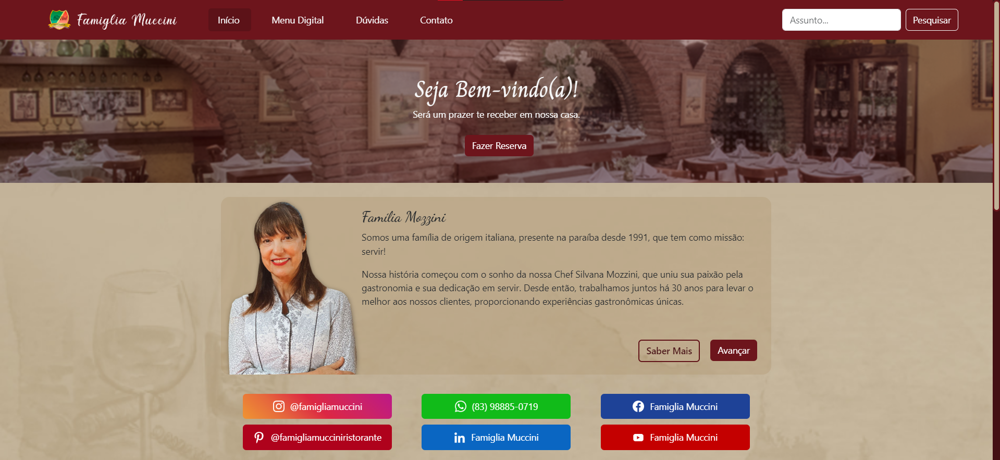

# Famiglia Muccini Website

<!---Esses são exemplos. Veja https://shields.io para outras pessoas ou para personalizar este conjunto de escudos. Você pode querer incluir dependências, status do projeto e informações de licença aqui--->

<!--  -->
<!-- 

 -->

> Website institucional para o Ristorante Famiglia Muccini, com intuito de divulgar e informar o público sobre o estabelecimento.

### Ajustes e melhorias

O projeto ainda está em desenvolvimento e as próximas atualizações serão voltadas nas seguintes tarefas:

-   [x] Adaptação para Bootstrap;
-   [x] Direcionamento para Redes Sociais;
-   [x] Direcionamento para o sistema de Reservas;
-   [x] Seção de Dúvidas;
-   [x] Seção de Pratos;
-   [ ] Seção de Momentos;
-   [x] Adaptação para SASS;
-   [x] Sessão de Contato;
-   [ ] Nova sessão em "Avançar";
-   [x] Lista de e-mails oficiais;
-   [x] Sistema de pesquisa.
-   [x] Domínio.
-   [ ] Otimização em SEO.

### Linguagens e Tecnologias

  <a href="https://github.com/romhenri/javascript" target="_blank">
  
  
  
  

### Autoria

<table>
  <tr>
    <td width="30%" align="center">
      <a href="https://github.com/romhenri">
         
        

          <b>Rômulo Henri</b>
        
      </a>
    </td>
    <td width="70%" align="center">
        
Trabalho para o Restaurante Famiglia Muccini.

         
        
Website desenvolvido com HTML e CSS. Depois foi aprimorado com Bootstrap e SASS.
  
        Iniciado: Dia 24, de Fevereiro (2023).
    </td>
  </tr>
</table>