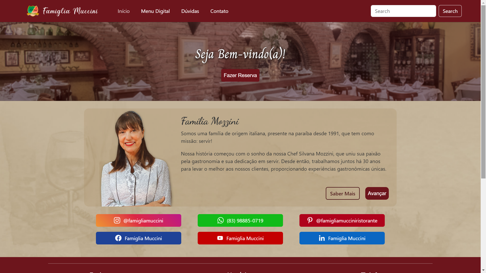

# Famiglia Muccini Website

<!---Esses são exemplos. Veja https://shields.io para outras pessoas ou para personalizar este conjunto de escudos. Você pode querer incluir dependências, status do projeto e informações de licença aqui--->

<!--  -->
<!-- 

 -->

> Website institucional para o Ristorante Famiglia Muccini, com intuito de divulgar e informar o público sobre o estabelecimento.

### Ajustes e melhorias

O projeto ainda está em desenvolvimento e as próximas atualizações serão voltadas nas seguintes tarefas:

-   [x] Adaptação para Bootstrap;
-   [x] Direcionamento para Redes Sociais;
-   [x] Direcionamento para o sistema de Reservas;
-   [x] Seção de Dúvidas;
-   [x] Seção de Pratos;
-   [ ] Seção de Momentos;
-   [x] Adaptação para SASS;
-   [ ] Sessão de Contato;
-   [ ] Nova sessão em "Avançar";
-   [ ] Lista de e-mails oficiais;
-   [x] Sistema de pesquisa.

### Linguagens e Tecnologias

  

<!--   

   -->

 

<!-- ### Equipe

Agradecemos às seguintes pessoas que contribuíram para este projeto:

<table>
  <tr>
    <td align="center">
      <a href="#">
         
        
          <b>Iuri Silva</b>
        
      </a>
    </td>
    <td align="center">
      <a href="#">
         
        
          <b>Mark Zuckerberg</b>
        
      </a>
    </td>
    <td align="center">
      <a href="#">
         
        
          <b>Steve Jobs</b>
        
      </a>
    </td>
  </tr>
</table> -->

<!-- ## 📝 Licença

Esse projeto está sob licença. Veja o arquivo [LICENÇA](LICENSE.md) para mais detalhes. -->

<!-- [⬆ Voltar ao topo](#nome-do-projeto)  -->
